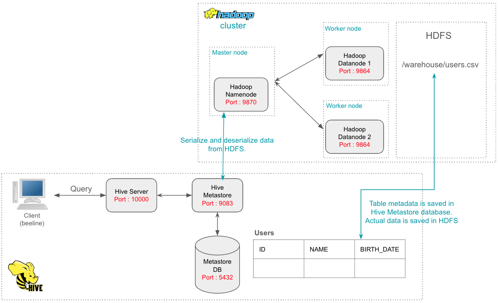

Table of contents

- [Local Hadoop ecosystem project](#local-hadoop-ecosystem-project)
- [Code structure](#code-structure)
- [Currently available components](#currently-available-components)
    - [1. Hadoop cluster](#1-hadoop-cluster)
      - [1.1. Namenode](#11-namenode)
      - [1.2. Datanode](#12-datanode)
      - [1.3. HDFS (Hadoop Distributed file system)](#13-hdfs-hadoop-distributed-file-system)
      - [1.4. YARN (Yet another resource negotiator)](#14-yarn-yet-another-resource-negotiator)
    - [2. Apache Hive](#2-apache-hive)
    - [2. Apache Spark](#2-apache-spark)
- [TODO](#todo)


# Local Hadoop ecosystem project

This project is created for learning purposes. 

It provides a way to test Hadoop related tasks in local machine. All components are run in docker environment.

Note that only basic Hadoop components are part of this project.

# Code structure

* `cluster/compose.cluster.yml` contains services allowing to set up a Hadoop cluster.
    * Start only Hadoop cluster : `docker compose -f cluster/compose.cluster.yml up -d`
    
* `cluster/compose.hive.yml` contains services allowing to set up Hive services.
    * Start Hive and the Hadoop cluster : `docker compose -f cluster/compose.hive.yml up -d`

* `cluster/compose.spark.yml` for starting PySpark client container.
    * Start PySpark client container in order to deploy applications that run on top of YARN  : `docker compose -f cluster/compose.spark.yml up -d`

# Currently available components

### 1. Hadoop cluster

 

The docker image used for the Hadoop cluster is built locally from the Dockerfile available in this repository : https://github.com/bigdatafoundation/docker-hadoop/blob/master/3.3.6/Dockerfile

This image installs Java 8, Hadoop 3.3.6 and YARN.

#### 1.1. Namenode


Hadoop Namenode is responsible for managing a set of data nodes. Namenode does not contain actual data. It stores metadata.

* In the `cluster/compose.cluster.yml` file the Namenode is created in the `namenode` service.
* Access the Namenode UI : http://localhost:9870/

    


#### 1.2. Datanode

Responsible of storing actual data. A Hadoop cluster can have multiple datanodes. If a datanode goes down then it will not affect the Hadoop cluster due to replication.

* In the `cluster/compose.cluster.yml` file, two Datanodes are created. `datanode-1` and `datanode-2` services.
* Access the Datanode UI : 
    * datanode-1 : http://localhost:9864
    * datanode-2 : http://localhost:9865

    


#### 1.3. HDFS (Hadoop Distributed file system)

This is the file system of a Hadoop cluster. When a file is loaded into HDFS, it is actually split to multiple blocks and each block will be stored in multiple data nodes.
This will enable fault tolerance.

* To interact with HDFS, multiple options are there : 
    * By entering the Namenode container :
        * `docker exec -it [namenode_container_id] bash`
        * Run HDFS commands : e.g. `hadoop fs -ls /`
    * By creating another hadoop client container and connecting it to the Namenode ...

* It is also possible to interact with HDFS using the Namenode UI : http://localhost:9870/explorer.html
    

#### 1.4. YARN (Yet another resource negotiator)

Manage the Hadoop cluster resources, schedule compute resources, allocate resources for jobs execution etc. 

* In the `cluster/compose.cluster.yml` file, YARN is part of both Namenode and Datanode services. Yarn Resource Manager is run in the Namenode, and YARN Node Manager is run in the Datanodes.
* Access YARN from the UI : http://localhost:8088/

    

### 2. Apache Hive


Apache hive is a distributed data warehouse system. https://hive.apache.org/

In this project, Hive is created on top of the Hadoop cluster explained above. It can also work on top of other distributed systems like S3.
Hive only manages Tables structures and metadata, actual data is saved in HDFS.

Hive provides HiveQL as a SQL-like query tool. It executes MapReduce jobs behind the scenes.

* In the `cluster/compose.hive.yml` file, three services are created for managing the Hive local stack : 
    * **hive-server service** : Responsible for creating the Hive Server 2 to enable running queries against Hive. It interacts with the Hive metastore behind the scenes.
    * **hive-metastore service** : The Hive metastore manages and stores the structure of tables/ columns etc. in the data warehouse. It serializes and deserializes data from HDFS.
    * **hive-metastore-db** : A Postgresql database used by Hive Metastore in order to stor metadata.

* Hive server and Hive metastore services are created using the official apache Hive Docker image. https://hub.docker.com/r/apache/hive

* Access Hive Server UI : http://localhost:10002

    

* Interact with hive :
    * Connect to Hive : 
        * `docker exec -it cluster-hive-server-1 beeline -u 'jdbc:hive2://localhost:10000/'`
    * Create an external table connected to HDFS : 
        ````
            CREATE EXTERNAL TABLE IF NOT EXISTS USERS(
                ID INT,
                NAME STRING,
                BIRTH_DATE DATE
            )
            ROW FORMAT DELIMITED FIELDS TERMINATED BY ','
            location 'hdfs://namenode:9000/warehouse';
        ```
    * Load the created table from a csv file in HDFS
        * `LOAD DATA INPATH 'hdfs://namenode:9000/users.csv' OVERWRITE INTO TABLE users;`
    * Query the table :
        * `SELECT * FROM users;`

    


### 2. Apache Spark

Apache Spark is a multi-language engine for executing data engineering, data science, and machine learning on single-node machines or clusters.
(https://spark.apache.org/)

In this project, the objective is to run Spark jobs on top of the Hadoop cluster. In this case, Spark uses YARN as the cluster manager.

* `cluster/compose.spark.yml` has one service with PySpark installed and configured to connect to the Hadoop cluster (YARN & HDFS) by providing the two configuration files `core-site.xml` and `yarn-site.xml`.

* Deploy a sample Spark job to the Hadoop cluster :
  * Put PySpark applications under the `cluster/spark-apps` folder. Applications will be places under `~/work-dir/apps` in the client container because of the configured folder.
  * Deploy the sample Spark application on top of the Hadoop cluster
    * `docker compose -f compose.spark.yml run spark spark-submit --master yarn --deploy-mode client apps/app.py`
    * This application simply reads a CSV file from HDFS, then it shows results.
    * Check job details in SPARK UI : `http://localhost:4040/jobs/`


# TODO

* [configuration] add the ability to update Hadoop cluster default settings (namenode, datanode and YARN) using a local volume.
* [documentation] document Prefect server/worker creation, deployments, secrets etc.
* [documentation] document Spark history server
* [configuration] create /spark-logs in HDFS automatically for Spark history server logs
* [documentation] document PySpark packaging process
* [documentation] document Yarn cluster mode, client mode when submitting Spark jobs
* [configuration] performance parameters : number of workers, used memory, CPUs etc.
* [development] include python packages to the PySpark package (zip)